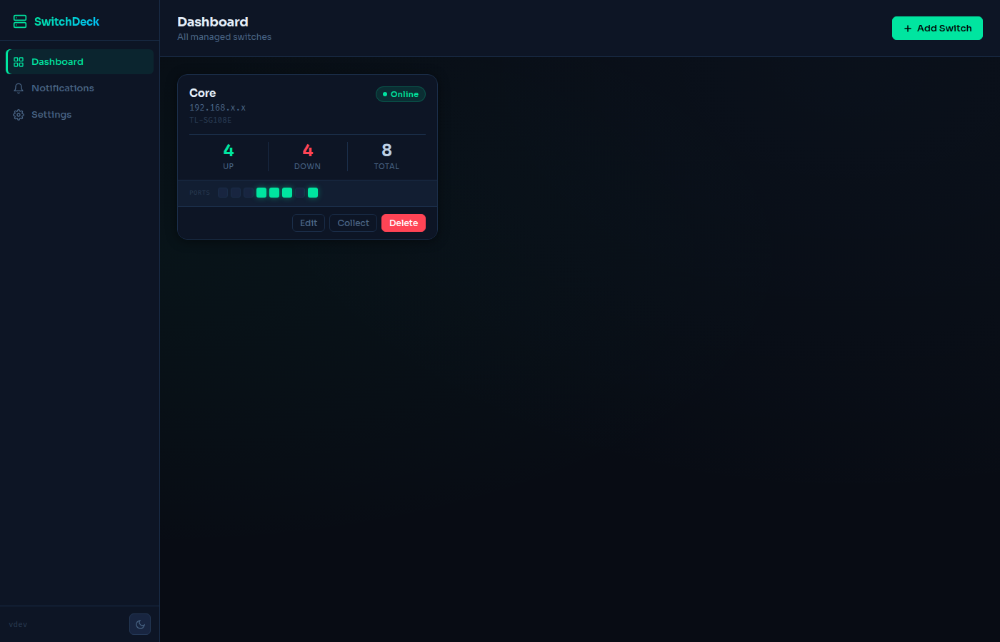
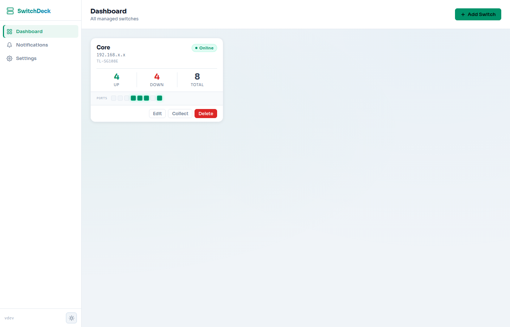
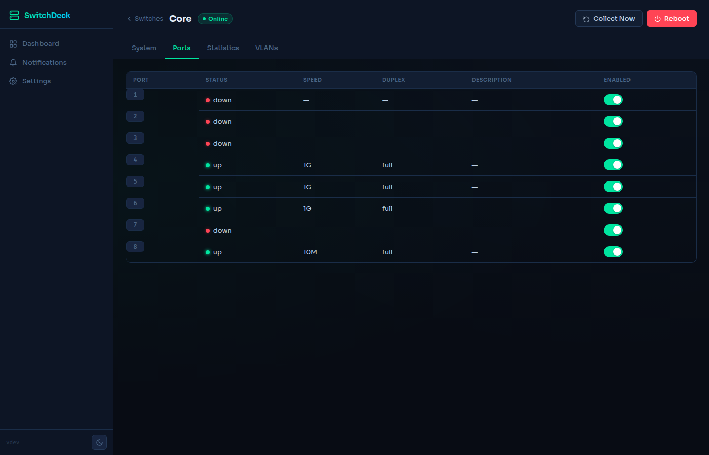
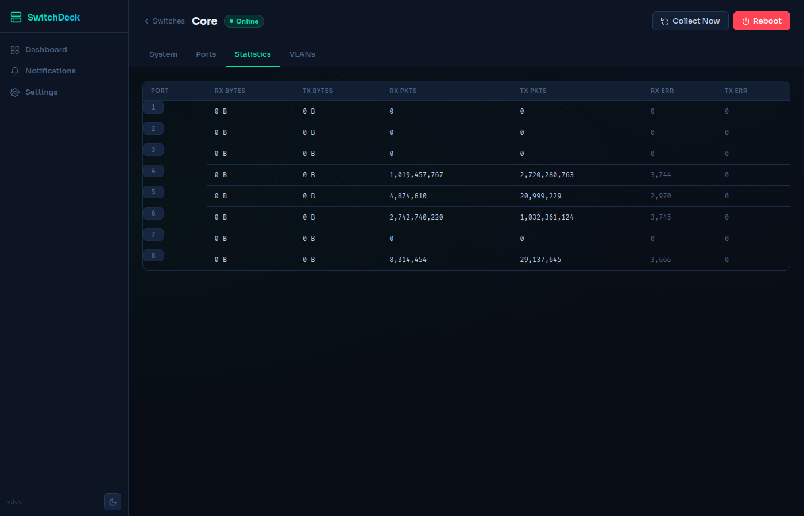
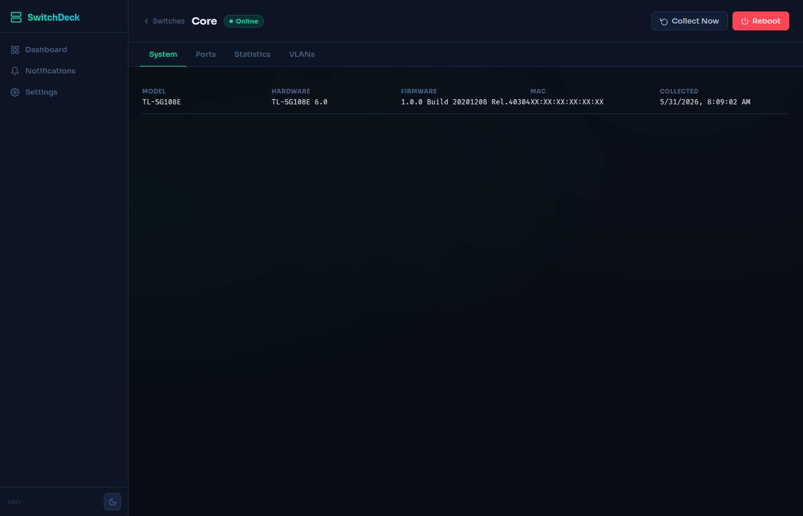
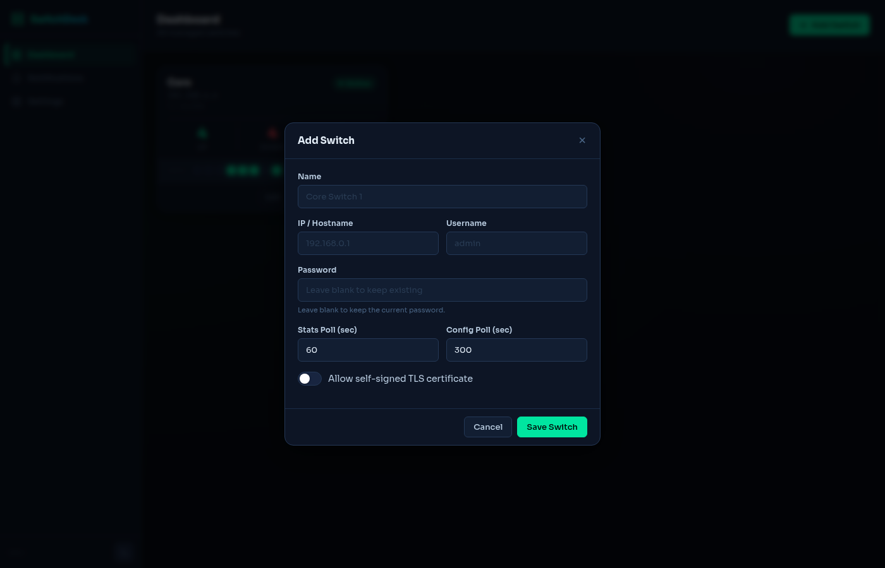
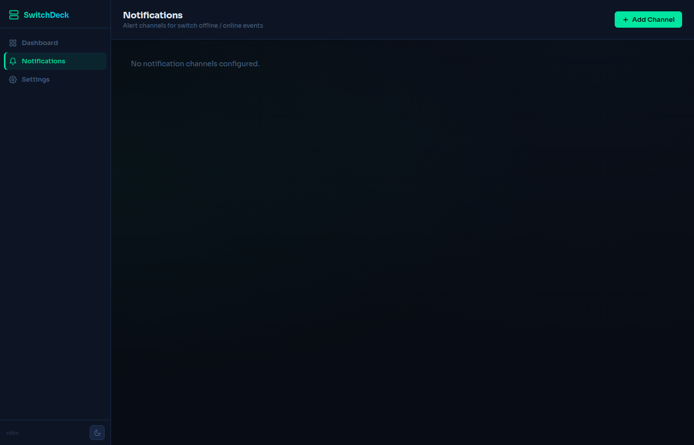
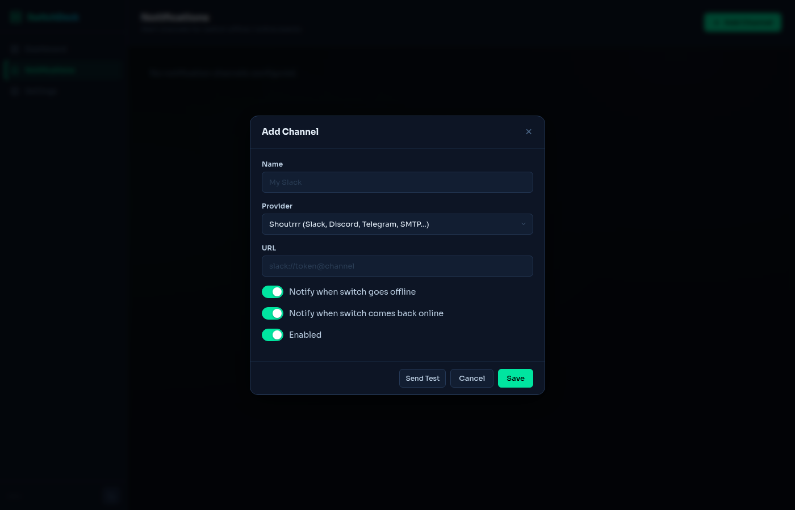
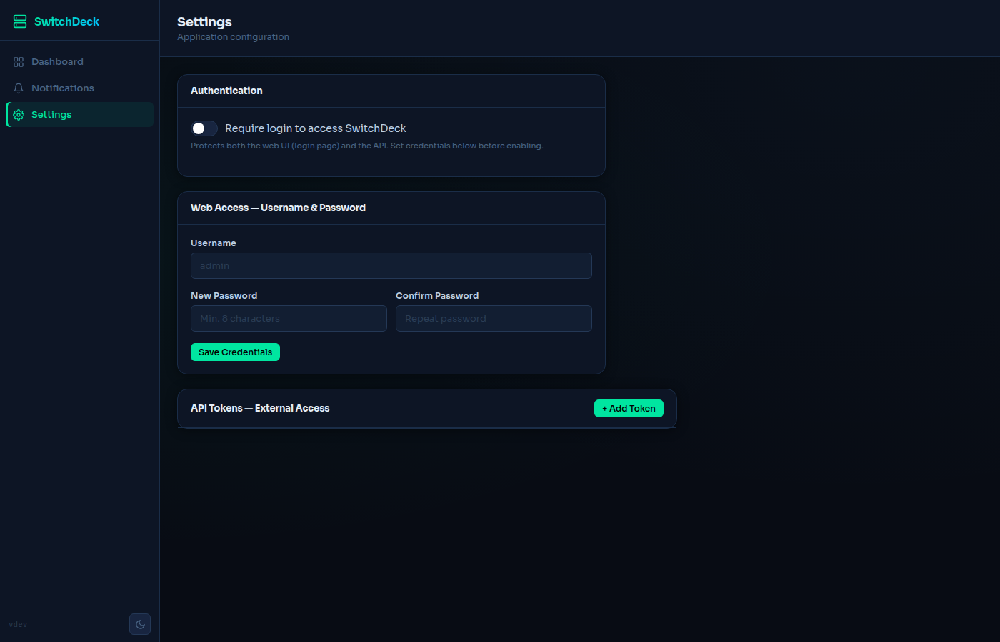
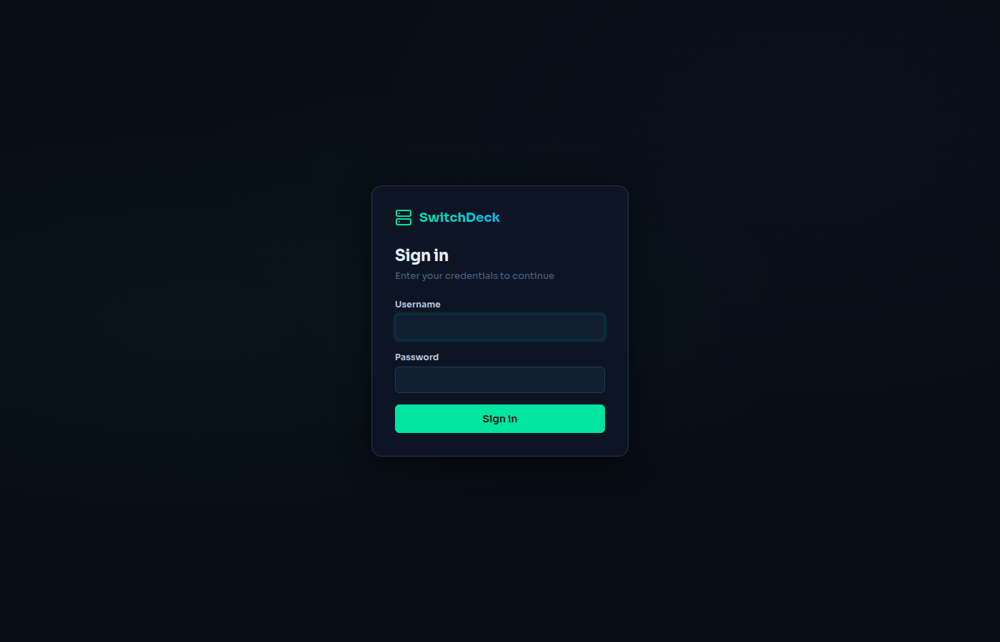

# SwitchDeck

SwitchDeck is a self-hosted central management portal for **TP-Link smart switches** on a local network. Instead of logging into each switch's web UI separately, SwitchDeck gives you a single dashboard to monitor and manage all your switches in one place.

Built in Go with an embedded web UI — a single binary, no external dependencies.

## Features

- **Multi-switch dashboard** — monitor all switches at a glance; per-switch port LED strip shows live link state for each port
- **Real-time status** — online/offline detection with automatic background polling; data refreshes every 60 seconds
- **Port management** — view port status, speed, duplex, and description; enable or disable individual ports
- **Port statistics** — per-port RX/TX byte and packet counters, error and drop counts
- **VLAN management** — view and manage 802.1Q VLAN configuration
- **System information** — model, hardware and firmware version, MAC address, last-collected timestamp
- **Notifications** — send alerts when a switch goes offline or comes back online; supports Shoutrrr (Slack, Discord, Telegram, SMTP, ntfy, Gotify, and more), GreenAPI (WhatsApp Cloud), and WhatsApp Web (self-hosted)
- **Authentication** — optional username/password login with argon2id-hashed passwords and HMAC-SHA256 signed session cookies; CLI `--reset-password` flag for credential recovery
- **API tokens** — named bearer tokens for external API access (e.g. Home Assistant, scripts); each token is stored as a SHA-256 hash and shown in plaintext only once
- **Dark / light mode** — system-preference-aware toggle; preference persisted in `localStorage`
- **Responsive layout** — collapsible sidebar on desktop; fixed bottom tab bar on mobile
- **Docker-ready** — multi-arch image (`amd64`, `arm64`, `armv7`) published to Docker Hub

## Screenshots

### Dashboard — Dark Mode


### Dashboard — Light Mode


### Switch Detail — Ports


### Switch Detail — Statistics


### Switch Detail — System Info


### Add Switch


### Notifications


### Add Notification Channel


### Settings


### Login


## Installation

### Docker (recommended)

```bash
docker run -d \
  --name switchdeck \
  -p 8080:8080 \
  -v switchdeck-data:/data \
  --restart unless-stopped \
  techblog/switchdeck:latest
```

Or with Docker Compose:

```yaml
services:
  switchdeck:
    image: techblog/switchdeck:latest
    ports:
      - "8080:8080"
    volumes:
      - switchdeck-data:/data
    restart: unless-stopped

volumes:
  switchdeck-data:
```

Then open `http://localhost:8080` in your browser.

### From pre-built binaries

Download the latest release from the [Releases page](https://github.com/t0mer/SwitchDeck/releases), then:

```bash
# Linux amd64 example
chmod +x switchdeck-linux-amd64
./switchdeck-linux-amd64
```

### Build from source

Requirements: **Go 1.25+**

```bash
git clone https://github.com/t0mer/SwitchDeck.git
cd SwitchDeck
go build -o switchdeck ./cmd/switchdeck
./switchdeck
```

## Running

### CLI flags

| Flag | Default | Description |
|---|---|---|
| `--port` | `8080` | HTTP listening port |
| `--data` | `/data/switchdeck` | Data directory (SQLite database) |
| `--log-level` | `info` | Log level: `debug`, `info`, `warning`, `error` |
| `--version` | — | Print version and exit |
| `--reset-password` | — | Interactively reset admin credentials and exit |

### Environment variables

Environment variables take precedence over built-in defaults; flags take precedence over environment variables.

| Variable | Equivalent flag | Description |
|---|---|---|
| `PORT` | `--port` | Listening port |
| `DATA_DIR` | `--data` | Data directory |
| `LOG_LEVEL` | `--log-level` | Log level |

### Examples

```bash
# Custom port and data directory
./switchdeck --port 9090 --data /var/lib/switchdeck

# Reset admin password from the CLI (no server needed)
./switchdeck --reset-password --data /var/lib/switchdeck
```

### As a system service

```bash
./switchdeck --service install
./switchdeck --service start
```

Supported actions: `install`, `uninstall`, `start`, `stop`, `restart`.

## Configuration

All configuration is managed through the **Settings** page in the UI. No configuration files are needed.

### Authentication

By default SwitchDeck is open (no login required). To protect the application:

1. Open **Settings → Web Access** and enter a username and password, then click **Save Credentials**.
2. Toggle **Require login to access SwitchDeck** on.

All web UI pages and API endpoints will now require authentication.

To reset credentials without access to the UI:

```bash
./switchdeck --reset-password --data /var/lib/switchdeck
```

### API tokens

For external integrations (Home Assistant, scripts, monitoring tools):

1. Open **Settings → API Tokens** and click **+ Add Token**.
2. Give the token a name and an optional expiry.
3. Copy the token from the confirmation dialog — it is shown **only once**.

Use the token in requests:

```bash
curl -H "Authorization: Bearer <token>" http://localhost:8080/api/v1/switches
```

### Notifications

Open the **Notifications** page and click **+ Add Channel**. Supported providers:

| Provider | Use case |
|---|---|
| **Shoutrrr** | Slack, Discord, Telegram, SMTP, ntfy, Gotify, and [many more](https://containrrr.dev/shoutrrr/) via a single URL scheme |
| **GreenAPI** | WhatsApp messages via the GreenAPI cloud service |
| **WhatsApp Web** | WhatsApp messages via a self-hosted `go-whatsapp-web-multidevice` instance |

Each channel can be configured to notify on **switch offline**, **switch back online**, or both. Click **Send Test** to verify the configuration before saving.

### Adding a switch

Click **+ Add Switch** on the dashboard and fill in:

| Field | Description |
|---|---|
| **Name** | Display name (e.g. `Core`, `Floor 2`) |
| **IP / Hostname** | Switch management address (e.g. `192.168.0.10`) |
| **Username / Password** | Switch admin credentials |
| **Stats Poll** | How often to refresh counters in seconds (default: 60) |
| **Config Poll** | How often to refresh port/VLAN config in seconds (default: 300) |
| **Allow self-signed TLS** | Enable when the switch uses HTTPS with a self-signed certificate |

SwitchDeck starts collecting data immediately after the switch is saved.
