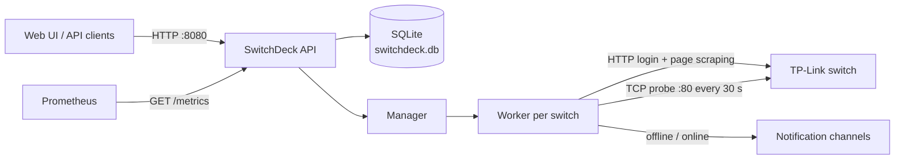

# SwitchDeck

[](https://github.com/t0mer/SwitchDeck/releases)
[](https://hub.docker.com/r/techblog/switchdeck)
[](LICENSE)

SwitchDeck is a self-hosted management portal for **TP-Link Easy Smart switches** on a local network. Instead of logging into each switch's web UI separately, you get one dashboard to monitor them, change port and switch settings, get offline/online alerts, and feed Prometheus and Grafana.

It is a single Go binary with an embedded web UI and a SQLite database. No external services are needed.

> [!WARNING]
> SwitchDeck is an independent project. It is **not affiliated with, endorsed by, or supported by TP-Link**. It drives the switches' own web interface, and several actions (disabling ports, VLAN/LAG changes, reboot) can cut off network access, including your own. **Use it at your own risk, on your own network.**

## Contents

- [Features](#features)
- [Supported hardware](#supported-hardware)
- [Screenshots](#screenshots)
- [How it works](#how-it-works)
- [Installation](#installation)
- [Running](#running)
- [Configuration](#configuration)
- [Prometheus metrics](#prometheus-metrics)
- [Grafana dashboard](#grafana-dashboard)
- [API](#api)
- [Security notes](#security-notes)
- [Troubleshooting](#troubleshooting)
- [Development](#development)
- [Contributing](#contributing)
- [License](#license)

## Features

- **Multi-switch dashboard**: every switch on one page, with a per-port LED strip colored by link state and speed (disabled, down, 10M, 100M, 1G)
- **Background polling**: one worker per switch refreshes port counters (default every 60 s) and the full configuration (default every 300 s); a TCP probe every 30 s detects offline switches
- **Port management**: view status, speed and duplex; enable or disable ports from the UI; set speed and flow control through the API
- **Custom port names**: rename ports inline in the ports table; names are used in the UI, in Prometheus labels and in backups
- **Port statistics**: per-port good/bad packet counters (TX/RX), with a counter reset through the API
- **VLANs**: view 802.1Q VLANs and port membership; write VLAN configuration through the API
- **More switch settings through the API**: LAG (static trunks), port mirroring, QoS mode and port priority, storm control, IGMP snooping and loop prevention
- **System information**: model, hardware and firmware version, MAC address, last-collected time
- **Notifications** when a switch goes offline or comes back online, through Shoutrrr (Slack, Discord, Telegram, SMTP, ntfy, Gotify and more), Green-API (WhatsApp) or a self-hosted WhatsApp Web instance
- **Authentication** (optional): username/password login with argon2id-hashed passwords and HMAC-SHA256 signed session cookies; `--reset-password` CLI for recovery
- **API tokens**: named bearer tokens with optional expiry for scripts and integrations; stored as SHA-256 hashes and shown only once
- **Encrypted credentials**: switch passwords and notification settings are encrypted at rest with AES-256-GCM
- **Backup & restore**: one portable JSON file with switches, port names, login settings, API tokens and notification channels
- **Prometheus metrics** at `/metrics`, served from the in-memory cache, plus a ready-made **Grafana dashboard**
- **Dark / light mode** toggle (dark by default; the choice is saved in `localStorage`) and a responsive layout with a bottom tab bar on mobile
- **Multi-arch Docker image** (`amd64`, `arm64`, `armv7`) on Docker Hub, and release binaries for Linux, macOS and Windows

## Supported hardware

SwitchDeck talks to the switch's built-in web interface (`/logon.cgi`, `/SystemInfoRpm.htm`, `/PortSettingRpm.htm` and similar pages).

| Model | Status |
|---|---|
| TP-Link **TL-SG108E**, hardware 6.0, firmware `1.0.0 Build 20201208 Rel.40304` | Developed and tested against this model (test fixtures and code comments) |
| Other TP-Link Easy Smart models | Untested. Pages that parse may work, but port changes through the API are limited to ports 1–8. <!-- TODO: verify other models --> |

Not collected by the current TP-Link client: PoE, STP, MAC table and LLDP data. The matching metrics are either missing or always 0 (see [Prometheus metrics](#prometheus-metrics)).

## Screenshots

### Dashboard — Dark Mode


### Dashboard — Light Mode


### Switch Detail — Ports


*This screenshot predates custom port names (the Name column) and the speed-based port colors.*
<!-- TODO: screenshot -->

### Switch Detail — Statistics


### Switch Detail — VLANs


### Switch Detail — System Info


### Add Switch


### Notifications


### Add Notification Channel


### Settings


### Backup & Restore


### Login


## How it works


```mermaid
flowchart LR
    UI[Web UI / API clients] -->|HTTP :8080| API[SwitchDeck API]
    Prom[Prometheus] -->|GET /metrics| API
    API --> DB[(SQLite<br/>switchdeck.db)]
    API --> MGR[Manager]
    MGR --> W1[Worker per switch]
    W1 -->|HTTP login + page scraping| SW[TP-Link switch]
    W1 -->|TCP probe :80 every 30 s| SW
    W1 -->|offline / online| N[Notification channels]
```

- On startup, SwitchDeck opens `<data>/switchdeck.db`, creates an encryption key on first run, and starts a **worker** for each enabled switch.
- Each worker logs in to the switch over `http://<ip>`, collects a full snapshot, and then runs three timers:
  - **Stats poll** (per switch, default 60 s): re-reads `/PortStatisticsRpm.htm`.
  - **Config poll** (per switch, default 300 s): re-reads all pages (system, ports, LAG, VLANs, IGMP, QoS, bandwidth, storm control, mirroring, loop prevention, statistics).
  - **Reachability probe** (fixed, every 30 s): a TCP connect to port 80 with a 3 s timeout. After **2 consecutive failures** the switch is marked offline and notifications are sent; when it answers again an "online" notification is sent.
- Each snapshot is kept in memory and saved to SQLite. The UI reads the saved snapshot and `/metrics` reads the in-memory copy, so page loads and scrapes never log in to the switches.
- **Collect / Collect Now** starts an immediate full collection with a fresh switch session.
- Write actions (port, VLAN, LAG, reboot, …) are sent straight to the switch using the worker's session.

## Installation

### Docker (recommended)

The image is `techblog/switchdeck` on Docker Hub (`linux/amd64`, `linux/arm64`, `linux/arm/v7`). It runs as a non-root user (uid `65532`) on a distroless base, and stores its database in `/data` (the image starts with `--data /data`).

> [!IMPORTANT]
> **Fix the volume ownership once, before the first start.** In the image, `/data` exists only as a `VOLUME` and is owned by root, so a fresh volume is not writable by uid `65532`. The container then exits with `open store: ping db: unable to open database file (14)`.
>
> - **Named volume** (used by both examples below, name `switchdeck-data`):
>   ```bash
>   docker run --rm -v switchdeck-data:/data alpine:3 chown 65532:65532 /data
>   ```
>   Docker Compose prefixes volume names with the project name (e.g. `switchdeck_switchdeck-data`). Either run the command with that name, or add `name: switchdeck-data` under the volume in your compose file, as the example below does.
> - **Bind mount**: run `chown 65532:65532 <dir>` on the host directory.
>
> Mount the volume at **`/data`**. The `docker-compose.yml` and `deployments/docker-compose.yml` files in this repo mount it at `/data/switchdeck`, which doesn't match the image's `--data /data`, so the database would not be stored in that volume. Use the Compose example below instead.

```bash
docker run -d \
  --name switchdeck \
  -p 8080:8080 \
  -v switchdeck-data:/data \
  --restart unless-stopped \
  techblog/switchdeck:latest
```

Or with Docker Compose:

```yaml
services:
  switchdeck:
    image: techblog/switchdeck:latest
    ports:
      - "8080:8080"
    volumes:
      - switchdeck-data:/data
    restart: unless-stopped

volumes:
  switchdeck-data:
    name: switchdeck-data
```

Then open `http://localhost:8080`.

The volume holds `switchdeck.db`, which contains the encrypted switch credentials **and the key that decrypts them**. Keep it (and its backups) private.

Published tags: `latest`, `2026.5.1` and `dev`.

### Pre-built binaries

Download a binary from the [Releases page](https://github.com/t0mer/SwitchDeck/releases). Each release ships:

| Platform | File |
|---|---|
| Linux amd64 | `switchdeck-linux-amd64` |
| Linux arm64 | `switchdeck-linux-arm64` |
| Linux armv7 | `switchdeck-linux-arm-armvv7` |
| macOS Intel | `switchdeck-darwin-amd64` |
| macOS Apple Silicon | `switchdeck-darwin-arm64` |
| Windows amd64 | `switchdeck-windows-amd64.exe` |

```bash
chmod +x switchdeck-linux-amd64
./switchdeck-linux-amd64 --data ./data
```

> [!NOTE]
> The latest release is **2026.5.1** (May 2026), and the `latest` Docker image is built from it. Custom port names, the speed-colored port LEDs, the `switchdeck_port_info` metric and the Grafana dashboard were added later. To use them now, build from `main`.

### Build from source

Requires **Go 1.25+**. The build is pure Go (`CGO_ENABLED=0` works).

```bash
git clone https://github.com/t0mer/SwitchDeck.git
cd SwitchDeck
go build -o switchdeck ./cmd/switchdeck
./switchdeck --data ./data
```

## Running

### CLI flags

| Flag | Default | Description |
|---|---|---|
| `--port` | `8080` | HTTP listening port (all interfaces) |
| `--data` | `/data/switchdeck` | Data directory; the database is `<data>/switchdeck.db`. The Docker image passes `--data /data`. |
| `--log-level` | `info` | Accepted (`debug`, `info`, `warning`, `error`), but not applied to logging yet |
| `--version` | — | Print the version and exit |
| `--reset-password` | — | Set new admin credentials interactively and exit |

There are **no environment variables** and **no config file**. `configs/config.example.yaml` is documentation only and is not read. All other settings live in the database and are managed through the UI or API.

### Examples

```bash
# Custom port and data directory
./switchdeck --port 9090 --data /var/lib/switchdeck

# Reset the admin username and password (prompts on the terminal)
./switchdeck --reset-password --data /var/lib/switchdeck

# Docker: reset credentials inside the running container
docker exec -it switchdeck /switchdeck --reset-password --data /data
```

`GET /health` returns `{"status":"ok"}` and needs no authentication. The Docker `HEALTHCHECK` only runs `/switchdeck --version`.

## Configuration

### Adding a switch

Click **+ Add Switch** on the dashboard:

| Field | Description |
|---|---|
| **Name** | Display name (e.g. `Core`, `Floor 2`) |
| **IP / Hostname** | Switch management address (e.g. `192.168.0.10`) |
| **Username / Password** | The switch's admin credentials |
| **Stats Poll (sec)** | How often to refresh port counters (default 60, UI minimum 10) |
| **Config Poll (sec)** | How often to refresh the full configuration (default 300, UI minimum 30) |
| **Allow self-signed TLS certificate** | Stored, but currently has no effect: SwitchDeck always connects to switches over plain `http://` |

SwitchDeck starts a worker and collects data right after you save.

> [!IMPORTANT]
> When you **edit** a switch, type the password again. The form says "leave blank to keep existing", but the current code saves the field as entered, including an empty password.

On the dashboard each card has **Edit**, **Collect** and **Delete**. The switch page has **System**, **Ports**, **Statistics** and **VLANs** tabs plus **Collect Now** and **Reboot** buttons. On the **Ports** tab you can toggle a port on or off and rename it.

### Authentication

By default SwitchDeck is open. To require a login:

1. Open **Settings → Web Access**, enter a username and a password (at least 8 characters), and click **Save Credentials**.
2. Turn on **Require login to access SwitchDeck**.

Login is enforced only when it is enabled **and** a username is set. It then covers all UI pages and `/api/v1/*`, except the login endpoints. `/health`, `/login`, `/static/*` and `/metrics` always stay public.

- Passwords are hashed with argon2id.
- Sessions are stateless cookies (`sd_session`, `HttpOnly`, `SameSite=Lax`, valid for 24 hours) signed with HMAC-SHA256. The signing secret is generated on first use and stored in the database.
- Logging out clears the cookie in the browser only.
- If you are locked out, run `--reset-password` (see [Examples](#examples)).

### API tokens

For scripts, Home Assistant, monitoring tools and other integrations:

1. Open **Settings → API Tokens** and click **+ Add Token**.
2. Enter a name and an optional expiry.
3. Copy the token from the confirmation dialog. It is shown **only once**; SwitchDeck stores only its SHA-256 hash.

```bash
curl -H "Authorization: Bearer <token>" http://localhost:8080/api/v1/switches
```

Tokens work on `/api/v1/*` only, not on the UI pages.

### Notifications

Open **Notifications** and click **+ Add Channel**. Each channel has a name, a provider, provider settings and three toggles: **Notify when switch goes offline**, **Notify when switch comes back online** and **Enabled**. **Send Test** sends a real test message with the values in the form before you save.

| Provider | Settings (JSON keys) | Notes |
|---|---|---|
| **Shoutrrr** | `url` | Slack, Discord, Telegram, SMTP, ntfy, Gotify and [many more](https://containrrr.dev/shoutrrr/), e.g. `slack://token@channel` |
| **Green-API** (WhatsApp) | `instance_id`, `token`, `recipient`, `api_url` (optional) | `api_url` defaults to `https://api.green-api.com`. Use the international number without `+` or spaces (e.g. `972501234567`); `@c.us` is appended when the value has no `@`. |
| **WhatsApp Web** | `base_url`, `recipient`, `username`, `password` (optional) | A self-hosted `go-whatsapp-web-multidevice` instance; SwitchDeck calls `POST <base_url>/send/message`, with Basic Auth if a username is set. |

> [!IMPORTANT]
> When you **edit** a channel in the UI, re-enter all provider fields (URL, token, recipient and so on). The API never returns stored channel settings, so the edit form starts empty, and saving replaces the stored settings with whatever is in the form.

Channel settings are encrypted at rest and never returned by the API. Sending is best effort: failures are logged and never block polling.

### Backup & Restore

Open **Settings → Backup & Restore**.

- **Download Backup** saves `switchdeck-backup-<timestamp>.json`. It contains:
  - all switches, **with their passwords in plaintext**
  - custom port names
  - login settings (`auth_enabled`, username and password hash)
  - API tokens (as hashes, so existing tokens keep working after a restore)
  - notification channels, **with their credentials in plaintext**

  It does **not** contain the server's encryption key, the session secret or collected switch data. **Store the file securely.**
- **Restore** uploads a backup file. It **deletes all existing switches, port names, API tokens and notification channels**, then imports the file. Login settings from the file overwrite the current ones. Credentials are re-encrypted with the target server's key, so backups move between servers.

Restore through the API:

```bash
curl -X POST http://localhost:8080/api/v1/backup/restore \
  -H "Authorization: Bearer <token>" \
  -F "file=@switchdeck-backup-2026-05-31T120000Z.json"
```

The request can also send the JSON as the raw request body. The limit is 8 MB.

> [!NOTE]
> Restore writes to the database but does not restart the polling workers. Restart SwitchDeck after a restore so that the restored switches are polled.

## Prometheus metrics

`GET /metrics` is always public. Add it to your Prometheus `scrape_configs`:

```yaml
scrape_configs:
  - job_name: switchdeck
    static_configs:
      - targets: ["localhost:8080"]
```

Metrics come from the in-memory worker cache, so a scrape never logs in to a switch. Only enabled switches are exported.

All metric names start with `switchdeck_`. Switch-level metrics carry `switch_id` and `switch_name` labels; port-level metrics add `port`.

| Metric | Type | Labels / notes |
|---|---|---|
| `switch_info` | Gauge (always 1) | + `ip`, `model`, `firmware`, `hardware` |
| `scrape_success` | Gauge | 1 if the worker has a cached snapshot |
| `switch_up` | Gauge | 1 if the worker has a cached snapshot (it does not follow the 30 s TCP probe) |
| `switch_collecting` | Gauge | 1 while a collection is running |
| `switch_ports_total` / `switch_ports_up` / `switch_ports_down` | Gauge | Port link summary |
| `switch_last_collected_timestamp_seconds` | Gauge | Unix time of the last full collection |
| `port_info` | Gauge (always 1) | + `port_name` (custom name or `Port N`) |
| `port_up` / `port_enabled` / `port_speed_mbps` | Gauge | Link state, admin state, negotiated speed |
| `port_rx_packets_total` / `port_tx_packets_total` | Counter | Good packets |
| `port_rx_errors_total` / `port_tx_errors_total` | Counter | Bad packets |
| `port_rx_bytes_total` / `port_tx_bytes_total` / `port_rx_dropped_total` / `port_tx_dropped_total` | Counter | Always 0 on the TL-SG108E, which reports packet counts only |
| `igmp_enabled` / `igmp_groups_total` | Gauge | IGMP snooping |
| `qos_port_priority` | Gauge | 1 (lowest) to 4 (highest) |
| `bandwidth_ingress_kbps` / `bandwidth_egress_kbps` | Gauge | Rate limits, 0 = unlimited |
| `storm_broadcast_kbps` / `storm_multicast_kbps` / `storm_unknown_unicast_kbps` | Gauge | Storm thresholds, 0 = disabled |
| `loop_prevention_enabled` / `vlan_count` / `lag_count` | Gauge | Misc switch config |
| `mac_table_entries_total` / `lldp_neighbors_total` | Gauge | Always 0: not collected from the switch |
| `poe_budget_watts` / `poe_consumed_watts` / `poe_port_enabled` / `poe_port_watts` | Gauge | Defined, but not exported by the current TP-Link client |
| `stp_enabled` / `stp_port_state` | Gauge | Defined, but not exported by the current TP-Link client (state: forwarding=5, learning=4, listening=3, blocking=2, disabled=1) |

## Grafana dashboard

[`grafana/switchdeck-dashboard.json`](grafana/switchdeck-dashboard.json) is a dashboard for Grafana 10+ (uid `switchdeck-overview`). Import it through **Dashboards → New → Import** and select your Prometheus data source.

- **Variables:** `datasource` (Prometheus) and `switch` (values of `switch_name` from `switchdeck_switch_up`).
- **Rows:** Switch Overview (status, ports up/down/total, scrape success, last collected), Port Status (table plus up/down over time), Traffic (bytes/s and packets/s), Errors & Drops, PoE, Network Features (STP, IGMP, loop prevention, VLANs, LAGs, MAC table, LLDP, IGMP groups), Bandwidth & Storm Control, and QoS.

On a TL-SG108E the bytes, drops, PoE, STP, MAC table and LLDP panels stay empty or at 0 (see above).

## API

The REST API is under `/api/v1` and uses JSON. When authentication is enabled, send either the session cookie from `POST /api/v1/auth/login` or an `Authorization: Bearer <token>` header. Without it the API returns `401 {"error":"unauthorized"}`.

There is no OpenAPI/Swagger document; the tables below come from the router in `internal/server/server.go`.

### Auth (always public)

| Method | Path | Description |
|---|---|---|
| `POST` | `/api/v1/auth/login` | Body `{"username","password"}`; sets the session cookie |
| `POST` | `/api/v1/auth/logout` | Clears the session cookie |
| `GET` | `/api/v1/auth/session` | Returns `auth_enabled` and `authenticated` |

### Switches

| Method | Path | Description |
|---|---|---|
| `GET` | `/api/v1/switches` | List switches with status, model, port counts and per-port states |
| `POST` | `/api/v1/switches` | Add a switch: `name`, `ip`, `username`, `password` (required), `insecure_tls`, `poll_stats_secs`, `poll_config_secs` |
| `GET` | `/api/v1/switches/{id}` | Get one switch (the password is never returned) |
| `PUT` | `/api/v1/switches/{id}` | Replace the switch configuration (same fields as `POST`, plus `enabled`) |
| `DELETE` | `/api/v1/switches/{id}` | Remove a switch |
| `POST` | `/api/v1/switches/{id}/collect` | Start an immediate full collection (returns `202`) |
| `GET` | `/api/v1/switches/{id}/snapshot` | Full cached snapshot |
| `GET` | `/api/v1/switches/{id}/ports` | Ports |
| `GET` | `/api/v1/switches/{id}/stats` | Port statistics |
| `GET` | `/api/v1/switches/{id}/vlans` | VLANs |
| `GET` | `/api/v1/switches/{id}/lag` | LAG groups |
| `GET` | `/api/v1/switches/{id}/port-names` | Custom port names (`{"<port>": "<name>"}`) |
| `PUT` | `/api/v1/switches/{id}/port-names/{port}` | Body `{"name": "Uplink"}`; an empty name removes it |

### Switch actions (write to the switch)

These change the live switch configuration. A wrong value can take ports, VLANs or the whole switch offline.

| Method | Path | Body |
|---|---|---|
| `PATCH` | `/api/v1/switches/{id}/ports/{port}` | Any of `enabled` (bool), `speed`, `flow_control` (bool); ports 1–8 only. `speed` accepts `"10M"`, `"100M"` or `"1G"` (10M and 100M are set as full duplex); any other value sets Auto. |
| `POST` | `/api/v1/switches/{id}/stats/reset` | — (clears all port counters) |
| `PATCH` | `/api/v1/switches/{id}/vlans` | Array of `{"id", "name", "port_members": {"<port>": "tagged" \| "untagged" \| "excluded"}}` (replaces the 802.1Q VLAN setup). Also switches the device into 802.1Q VLAN mode. |
| `PATCH` | `/api/v1/switches/{id}/lag` | Array of `{"id", "name", "ports": [...]}` (static trunks). `name` is ignored; `id` 2 maps to trunk group 2 and any other `id` to group 1. |
| `PATCH` | `/api/v1/switches/{id}/mirror` | `{"enabled", "dest_port", "mode": "both" \| "ingress" \| "egress", "source_ports": [...]}` |
| `PATCH` | `/api/v1/switches/{id}/qos` | `{"mode": "port" \| "802.1p" \| "dscp", "ports": [{"port_number", "priority"}]}`. Ports missing from the array are reset to priority 1. |
| `PATCH` | `/api/v1/switches/{id}/storm-control` | Array of `{"port_number", "broadcast_kbps", "multicast_kbps", "unknown_unicast_kbps"}`. Ports missing from the array are reset to 0 (disabled). |
| `PATCH` | `/api/v1/switches/{id}/igmp` | `{"enabled": true}`. Also turns report suppression off. |
| `PATCH` | `/api/v1/switches/{id}/loop-prevention` | `{"enabled": true}` |
| `POST` | `/api/v1/switches/{id}/reboot` | — (the switch is unreachable for about 30 s) |

The TL-SG108E often closes the connection after a write without sending a response. For POST-based writes (VLAN, LAG, mirror, QoS, storm control and reboot), SwitchDeck treats a reset connection as success. GET-based writes (port changes, stats reset, IGMP and loop prevention) treat a reset connection as a failure. A port change is re-read from the switch and returned; other writes are confirmed on the next collection.

### Settings and API tokens

| Method | Path | Description |
|---|---|---|
| `GET` | `/api/v1/settings` | `auth_enabled`, `username_set` |
| `PUT` | `/api/v1/settings` | Any of `auth_enabled`; `username` + `password` together (password ≥ 8 characters) |
| `GET` | `/api/v1/settings/tokens` | List tokens (no secrets) |
| `POST` | `/api/v1/settings/tokens` | Body `{"name", "expiry"}` (Unix time, 0 = never); returns the plaintext `token` once |
| `DELETE` | `/api/v1/settings/tokens/{id}` | Revoke a token |

### Notifications

| Method | Path | Description |
|---|---|---|
| `GET` | `/api/v1/notifications` | List channels (settings are not returned) |
| `POST` | `/api/v1/notifications` | Body `{"name", "provider", "config", "enabled", "notify_offline", "notify_online"}`; `provider` is `shoutrrr`, `greenapi` or `whatsapp_web`; `config` is a JSON **string** with the provider settings |
| `PUT` | `/api/v1/notifications/{id}` | Update a channel; an empty `config` keeps the stored settings (the UI never sends an empty `config`) |
| `DELETE` | `/api/v1/notifications/{id}` | Remove a channel |
| `POST` | `/api/v1/notifications/test` | Body `{"provider", "config"}`; sends a test message |

### Backup

| Method | Path | Description |
|---|---|---|
| `GET` | `/api/v1/backup` | Download a full backup as JSON |
| `POST` | `/api/v1/backup/restore` | Restore from a backup (`multipart/form-data` field `file`, or the raw JSON body) |

### Public endpoints

| Method | Path | Description |
|---|---|---|
| `GET` | `/metrics` | Prometheus metrics |
| `GET` | `/health` | `{"status":"ok"}` |

## Security notes

- **Switch credentials travel in cleartext.** The Easy Smart web interface is plain HTTP, and SwitchDeck always logs in over `http://`. Anyone who can capture traffic between SwitchDeck and a switch can read the switch password. Keep the switch management network trusted.
- **Credentials at rest:** switch passwords and notification settings are encrypted with AES-256-GCM. The 32-byte key is generated on first run and stored (base64) in the same SQLite database. This protects against casual disclosure, not against someone who has the whole database file. Protect the data directory and its backups.
- **Backup files contain plaintext passwords** for every switch and notification channel.
- **App authentication is off by default.** Turn it on before anyone else can reach SwitchDeck. SwitchDeck serves plain HTTP, and the session cookie has no `Secure` flag, so use a TLS reverse proxy if you access it over an untrusted network. There is no rate limit on login attempts.
- **`/metrics` is public** and shows switch names, IPs, models and firmware versions.
- **Don't expose SwitchDeck to the internet.** It controls network hardware.
- **Write actions can disrupt your network**: disabling the uplink port, changing VLANs or LAGs, mirroring or rebooting can lock you out of the switch. Test changes on a port you can reach physically.

## Troubleshooting

- **Switch shows Offline**: SwitchDeck checks reachability with a TCP connection to port 80 every 30 s, and marks the switch offline after two failures in a row. Check that the switch web UI is reachable from the SwitchDeck host (with Docker, from inside the container network).
- **"authentication failed: wrong username or password"** in the logs: the switch rejected the credentials. Edit the switch and enter the password again.
- **Data looks stale after a switch reboot or credential change**: each worker logs in once, when it starts. **Collect** does a one-off refresh with a new session; to restart the worker itself, edit and save the switch (re-enter the password) or restart SwitchDeck.
- **Byte counters are 0**: the TL-SG108E reports only good and bad packet counts.
- **Restored switches are not polled**: restart SwitchDeck after a restore.
- **Locked out of the UI**: run `--reset-password` against the same data directory.

## Development

```bash
go test ./...                 # unit tests (switch HTML is parsed from fixtures in test/testdata)
go vet ./...
./scripts/dev.sh              # go run with --port ${PORT:-8080} --log-level ${LOG_LEVEL:-debug}
VERSION=dev ./scripts/build.sh   # cross-compile into dist/
```

`scripts/dev.sh` uses the default data directory `/data/switchdeck`; pass `--data` to `go run ./cmd/switchdeck` directly if you want a local folder.

Project layout:

```
cmd/switchdeck/            entry point, CLI flags, --reset-password
internal/api/handlers/     REST handlers
internal/api/middleware/   session / bearer-token auth
internal/auth/             argon2id hashing, signed session tokens
internal/backup/           backup export / restore
internal/manager/          per-switch workers, polling, reachability probe
internal/metrics/          Prometheus collector
internal/notification/     channels, senders (Shoutrrr, Green-API, WhatsApp Web)
internal/server/           chi router
internal/store/            SQLite store, AES-256-GCM helpers
internal/switchclient/     switch client interface + TP-Link implementation and parsers
internal/webui/            embedded templates, CSS, JS
grafana/                   Grafana dashboard
scripts/                   build.sh, dev.sh, next-version.sh
```

### Releases

Versions follow `YYYY.M.PATCH`. Release and GHCR publishing are started manually; Docker Build also runs automatically after a successful Release:

- **Release** (`release.yml`): computes the next version with `scripts/next-version.sh` (or takes one as input), builds all targets with `scripts/build.sh`, tags the commit and publishes a GitHub Release.
- **Docker Build** (`docker.yml`): runs after a successful Release, or manually. It builds `linux/amd64`, `linux/arm64` and `linux/arm/v7` images and pushes `techblog/switchdeck:latest` and `techblog/switchdeck:<latest tag>`.
- **Publish to GHCR** (`publish-ghcr.yml`): manual build and push to `ghcr.io/t0mer/switchdeck`. It has not been run yet, so no GHCR image exists.

## Contributing

Issues and pull requests are welcome. Please run `go test ./...` and `go vet ./...` before you open a pull request. Support for more switch models needs sanitized page fixtures (see `test/testdata/`). Remove real IPs, MACs and credentials first.

## License

[Apache License 2.0](LICENSE)
